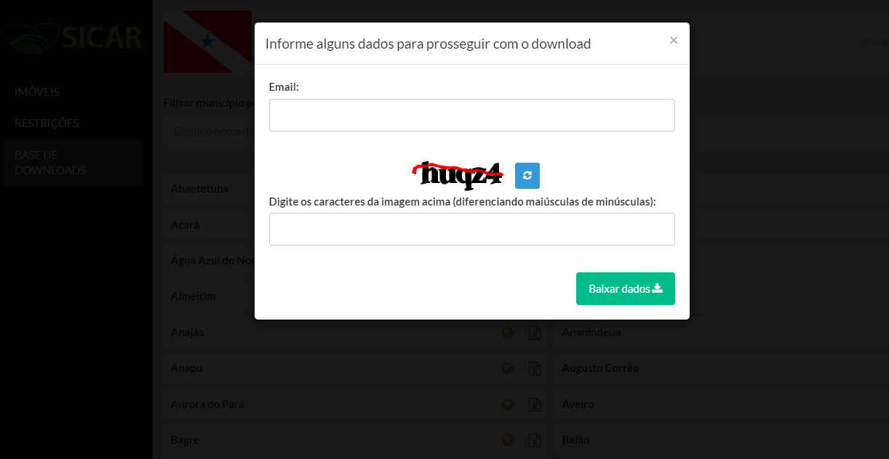
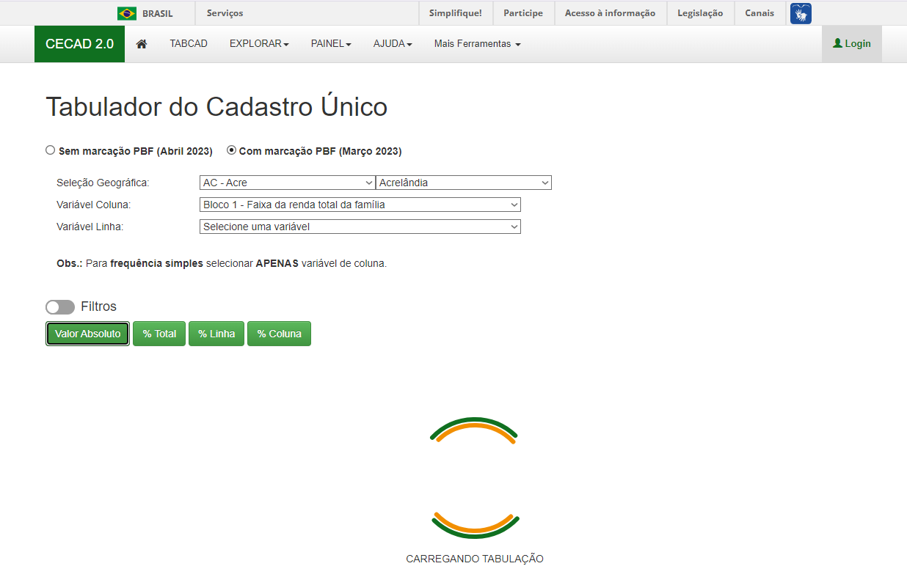
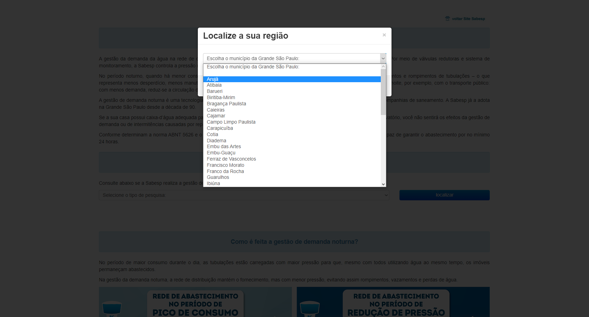

# Demonstrativo de webscrap e extração de pdfs
## Conteúdos
- [Webscrap com quebra de captcha](https://github.com/IcaroBernardes/scrapper#webscrap-com-quebra-de-captcha---r--python)
- [Webscrap por requisição](https://github.com/IcaroBernardes/scrapper#webscrap-por-requisição---r)
- [Webscrap por URL](https://github.com/IcaroBernardes/scrapper#webscrap-por-url---r)
- [Webscrap por headless browser](https://github.com/IcaroBernardes/scrapper#webscrap-por-headless-browser---r)
- [Extração de pdf](https://github.com/IcaroBernardes/scrapper#webscrap-por-headless-browser---r)

## Webscrap com quebra de captcha - R + Python
Emprega uma API para quebra de captcha e usa requisições (GET e POST) com cookies para garantir a manutenção da sessão.

🎯 Exemplo: extrair os arquivos com os shapefiles da cidade de Altamira/PA presentes nessa [página](https://www.car.gov.br/publico/municipios/downloads?sigla=PA)

📃 [Código](https://github.com/IcaroBernardes/scrapper/blob/master/scripts/webscrap_captcha.R)

🗂 [Resultado](https://github.com/IcaroBernardes/scrapper/blob/master/resultados/content_captcha)

## Webscrap por requisição - R
Se fundamenta em simular requisições (GET e POST) realizadas pela página durante o processo de envio de entradas e carregamento de resultados.

🎯 Exemplo: extrair as faixas de renda familiar (por pessoa e família) nos municípios do Acre contidos nessa [página](https://cecad.cidadania.gov.br/tab_cad.php)

📃 [Código](https://github.com/IcaroBernardes/scrapper/blob/master/scripts/webscrap_request.R)

🗂 [Resultado](https://github.com/IcaroBernardes/scrapper/blob/master/resultados/content_request.xlsx)

## Webscrap por URL - R
Usado em casos em que a página permite o envio de entradas e carregamento de resultados através da URL. Usualmente têm requisições por trás (GET e POST).

🎯 Exemplo: extrair informações básicas dos artigos mais recentes com as chaves "FGV" e "políticas públicas" na [Folha de São Paulo](https://search.folha.uol.com.br/?q=FGV&site=todos)

📃 [Código](https://github.com/IcaroBernardes/scrapper/blob/master/scripts/webscrap_urlt.R)

🗂 [Resultado](https://github.com/IcaroBernardes/scrapper/blob/master/resultados/content_url.xlsx)

## Webscrap por headless browser - R
Usada em casos em que não está claro como ocorre o envio de entradas e carregamento de resultados de uma página. Isto é, requisições (GET e POST) ou envio por url não são possíveis.

🎯 Exemplo: extrair os períodos de redução de pressão da água em bairros da capital de SP nessa [página](https://reducaopressao.sabesp.com.br)

📃 [Código](https://github.com/IcaroBernardes/scrapper/blob/master/scripts/webscrap_headless_browser.R)

🗂 [Resultado](https://github.com/IcaroBernardes/scrapper/blob/master/resultados/content_headless_browser.xlsx)

## Extração de pdf - Python
Extração em formato tabular dos dados presentes em um pdf.

🎯 Exemplo: extrair informações dos relatórios de autuações ambientais do IBAMA feitos em pdf e contidos nessa [pasta](https://github.com/IcaroBernardes/scrapper/blob/master/ibama)

📃 [Código](https://github.com/IcaroBernardes/scrapper/blob/master/scripts/extract_pdf.py)

🗂 [Resultado](https://github.com/IcaroBernardes/scrapper/blob/master/resultados/content_pdf)
